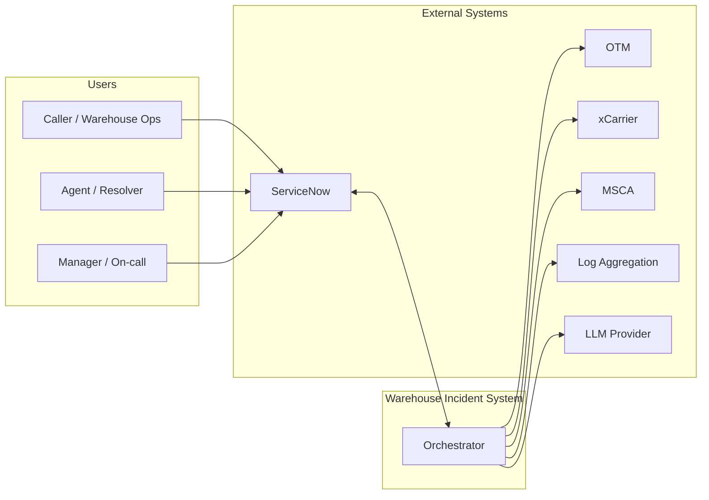
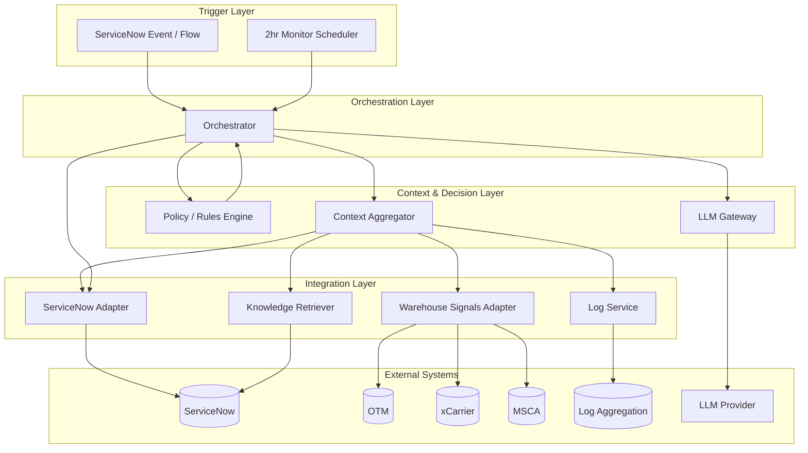
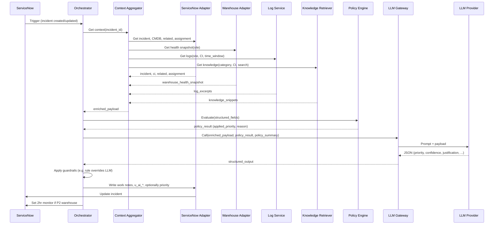
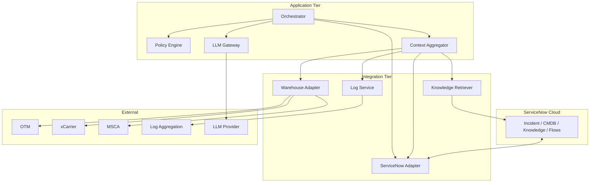

# Architectural Design: ServiceNow + LLM Warehouse Incident Management

**Document type:** Architectural Design  
**Context:** GE HealthCare – Warehouse incident management, P1/P2/P3 classification (GSPO)  
**Source:** Derived from [Warehouse-Incident-Design-Combined.md](Warehouse-Incident-Design-Combined.md)  
**Status:** Design only; no code implied.

---

## 1. Purpose and Scope

This document describes the **architectural design** for the ServiceNow + LLM warehouse incident solution: how components are structured, how data flows from incident creation through policy rules and LLM to ServiceNow updates, and how external systems (OTM, xCarrier, MSCA, logs, Knowledge) integrate. It is intended for solution architects and implementers. It does not specify implementation code.

**In scope:** System context, logical architecture, component responsibilities and interfaces, data flows, security and governance, key design decisions.  
**Out of scope:** Detailed API specs, database DDL, or prompt text.

---

## 2. System Context

### 2.1 Actors

| Actor | Role | Interaction |
|-------|------|-------------|
| **Caller / Warehouse ops** | Reports incident | Creates or updates incident in ServiceNow (Category Warehouse/Logistics). |
| **Agent / Resolver** | Triage and resolve | Views incident, sees AI-suggested priority and justification, approves or overrides; uses suggested next steps and draft comms. |
| **Manager / On-call** | Escalation and major incident | Receives P1 notifications; runs bridge; may override priority or approve LLM suggestion. |
| **System** | Automation | Triggers intake flow on incident create/update; runs 2-hour monitor on schedule; triggers P1 automation when priority = P1. |

### 2.2 External Systems

| System | Role | Direction |
|--------|------|-----------|
| **ServiceNow** | System of record for incidents, CMDB, Knowledge, assignment, Major Incident | Bidirectional: read incident + context; write priority, work notes, AI fields. |
| **OTM** | Transportation management signals (backlog, late shipments, throughput) | Outbound: orchestrator or adapter pulls metrics. |
| **xCarrier** | Shipping execution signals (label failures, print queue, station errors) | Outbound: orchestrator or adapter pulls metrics. |
| **MSCA** | Warehouse execution / RF (scanner sync, login, transaction queue, latency) | Outbound: orchestrator or adapter pulls metrics. |
| **Log aggregation** | Application, integration, infra, audit logs (e.g. Splunk, Elastic, Datadog) | Outbound: log service or orchestrator pulls excerpts by time/site/CI. |
| **LLM provider** | Azure OpenAI, OpenAI, or other – for summarization, priority suggestion, justification, drafts | Outbound: orchestrator or LLM gateway calls API. |

### 2.3 Context Diagram

---

## 3. Architectural Goals and Constraints

### 3.1 Goals

- **ServiceNow as system of record:** All incident state and AI outputs (suggested priority, justification, work notes) live in ServiceNow; no duplicate system of record.
- **Policy-first:** Deterministic rules (warehouse min P2, ops halted → P1, 2hr monitor, security → P1) run first and can override or bound LLM output.
- **Enriched context:** LLM receives incident + CMDB + related + knowledge base + warehouse health snapshot + log excerpts so it can summarize, justify, and draft accurately.
- **Auditability:** Full audit of what was pulled, what rules fired, what the LLM returned, and who approved or overrode.
- **Safety:** No automatic downgrade of P1 without approval; optional human approval for all P1 or for LLM-suggested P1 when rules did not set P1.

### 3.2 Constraints

- **No direct LLM write to production incident priority** without guardrails (rules override or human approval per chosen option A/B/C).
- **PHI/PII:** Redact in logs and in any stored payload before sending to LLM or logging.
- **Token and cost:** Enriched payload (incident + snapshot + logs + knowledge) must be size-limited (truncation, snippet caps) so calls stay within model and cost limits.

---

## 4. Logical Architecture

### 4.1 Layered View

### 4.2 Component Summary

| Layer | Component | Responsibility |
|-------|-----------|----------------|
| **Trigger** | ServiceNow event / flow | Fires on incident create or update (e.g. Category = Warehouse/Logistics); invokes orchestrator. |
| **Trigger** | 2hr monitor scheduler | Runs on schedule (e.g. every 15 min); finds warehouse P2 incidents past 2hr deadline; invokes orchestrator for re-check and possible P1 escalation. |
| **Orchestration** | Orchestrator | Coordinates flow: get context → run policy → build payload → call LLM → write back to ServiceNow; handles errors and retries. |
| **Context & Decision** | Policy / Rules Engine | Applies deterministic rules (services warehouse → min P2; ops halted or station threshold → P1; 2hr monitor; security → P1); returns applied_priority and reason. |
| **Context & Decision** | Context Aggregator | Calls ServiceNow adapter, warehouse adapter, log service, knowledge retriever; assembles normalized incident + snapshot + logs + knowledge_snippets. |
| **Context & Decision** | LLM Gateway | Sends enriched payload + policy outcome (and optional policy summary) to LLM; parses structured JSON (priority, confidence, justification, etc.); validates and returns to orchestrator. |
| **Integration** | ServiceNow Adapter | Reads incident, CMDB, related, assignment, warehouse custom fields; writes AI recommendation, work notes, priority (if allowed by guardrails). |
| **Integration** | Warehouse Signals Adapter | Pulls from OTM, xCarrier, MSCA (or a single warehouse API if aggregated); returns warehouse health snapshot (site_id, ops_state, stations_impacted_count, etc.). |
| **Integration** | Log Service | Queries log aggregation by time, site, CI, app; returns truncated excerpts (and optional error_codes); redacts PHI/PII. |
| **Integration** | Knowledge Retriever | Queries ServiceNow Knowledge by linkage, category, CI, or search; returns list of { title, snippet } (or kb_number, url); caps count and length. |

---

## 5. Component Design

### 5.1 Orchestrator

**Responsibility:** Single entry point for both “incident intake” and “2hr monitor” flows. Coordinates context aggregation, policy execution, LLM call, and write-back.

**Flow (intake):**  
1. Receive trigger (incident ID, trigger type = intake).  
2. Call Context Aggregator with incident ID → get enriched payload (incident, CI, related, knowledge_snippets, warehouse_health_snapshot, logs).  
3. Call Policy Engine with structured fields (site, warehouse_type, ops_state, stations_impacted, security_flag, etc.) → get policy_result (applied_priority, reason).  
4. Build LLM payload: enriched payload + policy_result + optional policy summary.  
5. Call LLM Gateway → get structured output (priority, confidence, justification, suggested_actions, missing_information).  
6. Apply guardrails: e.g. if option B, compare LLM priority to policy_result; if rule says P1, use P1; if LLM says P1 and rule doesn’t, escalate to human or hold.  
7. Call ServiceNow Adapter to write: u_ai_priority_recommendation, u_ai_confidence, work notes (summary, justification, suggested next steps), and optionally priority if auto-apply allowed.  
8. If P2 warehouse and not resolved, set 2hr monitor deadline. Notify resolver group if configured.

**Flow (2hr monitor):**  
1. Receive trigger (incident IDs past 2hr deadline).  
2. For each incident: refresh context (Context Aggregator) and policy (Policy Engine).  
3. If impact grown or still not resolved → escalate to P1 (update ServiceNow, trigger P1 automation if applicable).  
4. Post automated work note.

**Interfaces (conceptual):**  
- Input: incident_id, trigger_type (intake | 2hr_monitor).  
- Output: success/failure; optional callback or event for “escalate to human.”

### 5.2 Policy / Rules Engine

**Responsibility:** Pure deterministic logic. No LLM. Input: structured fields (site, warehouse_type, ops_state, stations_impacted_count, workaround_present, workaround_quality, security_compliance_risk). Output: applied_priority (P1|P2|P3), reason (e.g. “Services warehouse → min P2”), rule_triggered (e.g. “warehouse_min_p2”), and optional start_2hr_monitor (boolean).

**Rules (from combined doc):**  
1. If security_compliance_risk → P1.  
2. If operations_halted OR stations_impacted >= threshold (e.g. 3 or 25% of active) → P1.  
3. If services_warehouse AND (ops_state != halted AND below station threshold) → min P2; start_2hr_monitor = true.  
4. Else → standard ITIL-style scoring or pass-through (e.g. P3 or leave unchanged).

**Interface:** Input = structured object; output = { applied_priority, reason, rule_triggered, start_2hr_monitor }.

### 5.3 Context Aggregator

**Responsibility:** Assemble all context for one incident. Calls ServiceNow Adapter (incident, CMDB, related, assignment, warehouse fields), Warehouse Signals Adapter (health snapshot), Log Service (excerpts), Knowledge Retriever (snippets). Normalizes into the payload shape (incident, affected_ci, related, warehouse_health_snapshot, logs, knowledge_snippets). Handles time window (e.g. 1 hour before incident opened for logs). Applies token/size caps (truncate work notes, log excerpt, knowledge snippets).

**Interface:** Input = incident_id, options (e.g. include_logs: true, log_time_window_minutes: 60). Output = enriched payload (structured blob).

### 5.4 LLM Gateway

**Responsibility:** Single point of call to LLM provider. Builds prompt (system + user) including policy summary and enriched payload; requests structured JSON output (priority, confidence, justification, applied_rules_or_criteria, suggested_actions, missing_information); validates response (valid enum for priority, confidence); redacts or omits PHI/PII from prompt if needed. Returns parsed object or error.

**Interface:** Input = payload (enriched + policy_result + policy_summary), output_schema. Output = { priority, confidence, justification, … } or error.

### 5.5 ServiceNow Adapter

**Responsibility:** Read: incident (by ID), CMDB/CI for affected CI, related incidents/problems/changes, assignment group and on-call, Knowledge (or delegate to Knowledge Retriever). Write: incident fields (u_ai_priority_recommendation, u_ai_confidence, u_warehouse_site, u_ops_state, etc.), work notes (text), and optionally priority. Uses ServiceNow REST or mid-server; credentials in secure store.

### 5.6 Warehouse Signals Adapter

**Responsibility:** Call OTM, xCarrier, MSCA (or aggregated warehouse API) for the site/incident; map responses to warehouse health snapshot schema (site_id, warehouse_type, ops_state, stations_impacted_count, backlog_delta_per_hour, failed_tx_rate, top_error_codes, workaround_present, workaround_quality, last_healthy_timestamp). Return snapshot or partial snapshot on failure.

### 5.7 Log Service

**Responsibility:** Query log aggregation (Splunk, Elastic, etc.) by time range, site, CI, application (OTM, xCarrier, MSCA); return last N lines or summarized excerpt; redact PHI/PII; cap size. Return empty or “Logs unavailable” on timeout/failure.

### 5.8 Knowledge Retriever

**Responsibility:** Query ServiceNow Knowledge (or KB API) by incident category, affected CI, or full-text search on short_description/description; return list of { title, snippet } (or kb_number, url) with total length cap. Used by Context Aggregator to fill knowledge_snippets.

---

## 6. Data Flows

### 6.1 Warehouse Incident Intake (Flow 1)

### 6.2 2-Hour Warehouse Monitor (Flow 2)

Orchestrator receives list of incident IDs (from scheduler). For each: Context Aggregator refreshes snapshot and logs; Policy Engine re-evaluates; if impact grown or still not resolved → Orchestrator updates incident to P1 and optionally triggers P1 automation (bridge, notify). Automated work note posted.

### 6.3 P1 Major Incident Automation (Flow 3)

Triggered when incident priority = P1 (set by rule or human). Steps: open bridge, notify on-call, notify leadership, start update cadence, maintain executive summary. May be implemented inside ServiceNow (flow/notification) or by Orchestrator calling ServiceNow and notification services.

---

## 7. Deployment View (Conceptual)

- **ServiceNow** remains in its cloud tenant.  
- **Orchestrator, Policy Engine, Context Aggregator, LLM Gateway** can run in one or more services (e.g. cloud function, container, or single app server).  
- **Adapters and Log Service** may run in the same process as the orchestrator or as separate microservices; they need network access to ServiceNow, OTM/xCarrier/MSCA, and log aggregation.  
- **Secrets** (ServiceNow, warehouse systems, log store, LLM API key) in vault; no secrets in code.

---

## 8. Security and Governance

- **Authentication:** ServiceNow adapter uses OAuth or API token (stored in vault). Warehouse and log services use respective credentials (vault). LLM gateway uses provider API key (vault).  
- **Authorization:** Orchestrator and adapters run with a service identity; only needed permissions (read incident/CMDB/Knowledge, write incident/work notes) in ServiceNow.  
- **Data:** PHI/PII redaction in logs and in payloads before sending to LLM or to audit log.  
- **Audit:** Log for each run: incident_id, trigger_type, policy_result, LLM input summary (no PHI), LLM output, final priority written, who approved/overrode (if human in the loop). Retain per GE HealthCare policy.  
- **No auto-downgrade of P1** without explicit approval (configurable guardrail).

---

## 9. Key Design Decisions

| Decision | Rationale |
|----------|-----------|
| **ServiceNow as system of record** | Single source of truth; no sync of incident state to another system. |
| **Policy engine runs before LLM** | Deterministic rules enforce safety and warehouse policy; LLM augments within bounds. |
| **Enriched payload (incident + snapshot + logs + knowledge)** | LLM can summarize and justify with evidence; better drafts and next steps. |
| **Structured LLM output (JSON)** | Enables automation (write to fields, guardrails); validation prevents invalid priority. |
| **Optional human-in-the-loop for P1 / downgrade** | Aligns with Incident Priority Definitions and reduces risk of misclassification. |
| **Separate adapters for ServiceNow, warehouse, logs, knowledge** | Clear boundaries; each adapter can be replaced or scaled independently. |

---

## 10. References

- **Source design:** [Warehouse-Incident-Design-Combined.md](Warehouse-Incident-Design-Combined.md) (Part I–III).  
- **Incident Priority Definitions** – GSPO warehouse P1/P2/P3 and workaround rules.  
- **docs/Incident-Priority-Automation-Design.md** – Automation and ServiceNow + LLM alignment.  
- **Info/** – Original architecture docs.

---

*This architectural design is derived from the combined warehouse incident design. Design only; no code.*
