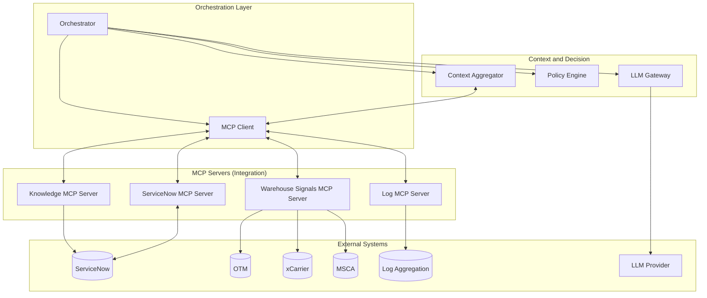
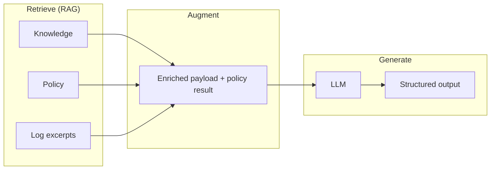

# MCP and RAG in the Warehouse Incident Solution

**Document type:** Design extension (MCP and RAG)  
**Context:** GE HealthCare – Warehouse incident management, P1/P2/P3 classification (GSPO)  
**Source:** Extends [05-Architectural-Design-Warehouse-Incident.md](05-Architectural-Design-Warehouse-Incident.md) and [Warehouse-Incident-Design-Combined.md](Warehouse-Incident-Design-Combined.md)  
**Author:** Omolewa Adaramola  
**Status:** Design only; no code implied.

---

## 1. Purpose and Scope

This document describes how **Model Context Protocol (MCP)** and **Retrieval-Augmented Generation (RAG)** can be included in the ServiceNow + LLM warehouse incident solution. It is an extension to the architectural design: the same flows (intake, 2hr monitor, P1 automation) and components (Orchestrator, Policy Engine, Context Aggregator, LLM Gateway) remain; MCP and RAG change *how* integration and retrieval are implemented and named.

**In scope:** Where MCP and RAG fit in the architecture; mapping current adapters to MCP servers; explicit RAG for knowledge and policy; benefits and options.  
**Out of scope:** Detailed MCP tool schemas, vector store implementation, or prompt text.

---

## 2. MCP (Model Context Protocol)

### 2.1 What is MCP?

**Model Context Protocol (MCP)** is an open protocol that lets LLM applications access **tools**, **resources**, and **prompts** from external servers in a standardized way. Servers expose capabilities (e.g. “get incident context”, “get warehouse health snapshot”); clients discover and invoke them via the protocol. MCP is increasingly adopted (e.g. Cursor, Claude, Copilot Studio) for AI–tool integration.

### 2.2 Current Design vs MCP

| Current (adapters) | With MCP |
|--------------------|----------|
| **ServiceNow Adapter** – direct REST or mid-server calls | **ServiceNow MCP Server** – tools such as `get_incident`, `get_incident_context` (CMDB, related, assignment), `write_work_notes`, `write_ai_fields`, `set_priority` (if allowed by guardrails). |
| **Warehouse Signals Adapter** – direct calls to OTM, xCarrier, MSCA | **Warehouse Signals MCP Server** – tool such as `get_warehouse_health_snapshot(site_id)`; server encapsulates OTM, xCarrier, MSCA. |
| **Log Service** – direct queries to Splunk/Elastic/etc. | **Log MCP Server** – tool such as `get_log_excerpts(site, ci, time_window, app)`. |
| **Knowledge Retriever** – direct ServiceNow Knowledge API | **Knowledge MCP Server** – tools such as `search_knowledge(category, ci, query)`, `get_articles_by_linkage(incident_id)`; can also expose a RAG-style retrieval tool. |

The **Orchestrator** (or **Context Aggregator**) uses an **MCP client** to discover (`tools/list`) and invoke (`tools/call`) these tools instead of calling adapters directly. Policy Engine and LLM Gateway are unchanged.

### 2.3 Architecture with MCP

### 2.4 MCP Server Responsibilities (Conceptual)

| MCP Server | Example tools | Backing |
|------------|----------------|--------|
| **ServiceNow MCP Server** | `get_incident(id)`, `get_incident_context(id)` (incident + CMDB + related + assignment), `write_work_notes(id, text)`, `write_ai_fields(id, fields)`, `set_priority(id, priority)` (if allowed) | ServiceNow REST or mid-server |
| **Warehouse Signals MCP Server** | `get_warehouse_health_snapshot(site_id)` | OTM, xCarrier, MSCA (or aggregated warehouse API) |
| **Log MCP Server** | `get_log_excerpts(site, ci, time_window, app)` | Splunk, Elastic, Datadog, etc. |
| **Knowledge MCP Server** | `search_knowledge(category, ci, query)`, `get_articles_by_linkage(incident_id)`, optionally `retrieve_relevant_articles(incident_summary)` (RAG) | ServiceNow Knowledge (and optionally vector store) |

### 2.5 Benefits of MCP in This Solution

- **Single protocol:** One way to discover and call all integration capabilities; new data sources = new MCP server, orchestrator unchanged.
- **Clear boundaries:** Each MCP server owns credentials and logic for one system; orchestrator stays agnostic of implementation.
- **Ecosystem alignment:** Fits Copilot Studio and other tools that support MCP; same servers can be reused for other workflows.
- **Extensibility:** Add Policy MCP Server (e.g. `get_relevant_policy(incident_summary)`) for policy RAG without changing the core flow.

---

## 3. RAG (Retrieval-Augmented Generation)

### 3.1 What is RAG?

**Retrieval-Augmented Generation (RAG)** means: **retrieve** relevant information from external sources (knowledge base, policy, logs), **augment** the LLM prompt with that context, then **generate** (summary, priority suggestion, justification, drafts). The LLM does not rely only on its training; it uses up-to-date, domain-specific content you provide.

### 3.2 RAG in the Current Design

The existing design already implements a RAG-like pattern for **knowledge**:

- **Retrieve:** Context Aggregator (via Knowledge Retriever) pulls ServiceNow Knowledge articles by linkage, category, CI, or search; returns snippets.
- **Augment:** Snippets are included in the payload sent to the LLM (e.g. `knowledge_snippets`).
- **Generate:** LLM uses them to suggest next steps, draft communications, and avoid contradicting SOPs.

This can be **named explicitly as RAG (knowledge)** in the architecture. No new component is required; the flow remains the same.

### 3.3 Policy RAG (Optional)

**Current:** Policy (Incident Priority Definitions, GSPO warehouse rules) is summarized in the prompt or passed as static text.

**With policy RAG:** Store policy as searchable content (e.g. chunks in a vector store or structured docs). For each incident, **retrieve** the most relevant policy snippets (e.g. by incident type, warehouse, priority rules). Feed those snippets into the prompt so the LLM “reads the same playbook” as the rules. This supports evolving policy without rewriting rule code and keeps the LLM aligned with the latest definitions.

Implementation options:

- **Policy MCP Server** with tool `get_relevant_policy(incident_summary)` that performs retrieval and returns chunks.
- **Context Aggregator** calls a policy retrieval service (or MCP tool) before building the LLM payload; result is merged into the “policy summary” section of the prompt.

### 3.4 Knowledge RAG Options

| Option | Description |
|--------|-------------|
| **Current (pre-fetch)** | Retrieve by linkage/category/CI/keyword; cap count and length; send snippets in payload. Already RAG in spirit; name it as such. |
| **Semantic / vector RAG** | Embed incident description (and optionally warehouse snapshot); query a vector index of KB articles (and optionally runbooks); return top-k chunks; add to payload. Implement inside Knowledge Retriever or Knowledge MCP Server. |
| **Hybrid** | Keep linkage/category for “must-have” articles; add vector search for “similar articles” to enrich context. |

### 3.5 Where RAG Sits in the Flow

- **Retrieve:** Done by Context Aggregator (or MCP client calling Knowledge/Policy/Log tools). Output: knowledge snippets, optional policy chunks, log excerpts.
- **Augment:** LLM Gateway (or Orchestrator) builds the prompt with this retrieved context plus incident, snapshot, and policy result.
- **Generate:** LLM returns structured output (priority, confidence, justification, suggested actions).

The existing “Warehouse Incident Intake” sequence (trigger → get context → policy → LLM → write back) is unchanged; the “get context” step is explicitly the **RAG retrieve** step, and the prompt build is the **augment** step.

### 3.6 RAG and Data Flow (Conceptual)

---

## 4. MCP and RAG Together

- **MCP** defines *how* the orchestrator gets data: via MCP servers (ServiceNow, Warehouse, Log, Knowledge, optionally Policy) instead of direct adapters.
- **RAG** defines *what* we do with that data: retrieve relevant knowledge (and optionally policy), then augment the LLM prompt.

The **Knowledge MCP Server** can expose both “get articles by linkage/category/search” and, if desired, a “RAG query” tool (e.g. vector search over KB). A **Policy MCP Server** can expose `get_relevant_policy(incident_summary)` for policy RAG. The Orchestrator (or Context Aggregator) calls these tools, gets retrieved context, and passes it to the LLM Gateway; the LLM Gateway still builds the augmented prompt and calls the LLM. No change to Policy Engine or guardrails (rules override, no auto-downgrade of P1).

---

## 5. Summary

| Topic | Inclusion |
|-------|-----------|
| **MCP** | Add an MCP Client in the orchestration/context layer; implement ServiceNow, Warehouse Signals, Log, and Knowledge as MCP servers with tools as above. Orchestrator (or Context Aggregator) uses MCP client instead of direct adapter calls. |
| **RAG** | Name existing knowledge retrieval + prompt augmentation as **RAG (knowledge)**. Optionally add **policy RAG** (retrieve relevant policy chunks per incident). Optionally add **semantic/vector RAG** for knowledge inside Knowledge Retriever or Knowledge MCP Server. |
| **Together** | MCP = integration protocol; RAG = retrieve → augment → generate. Knowledge (and optionally Policy) MCP servers can implement RAG-style tools; orchestrator flow stays the same. |

---

## 6. References

- [05-Architectural-Design-Warehouse-Incident.md](05-Architectural-Design-Warehouse-Incident.md) – Base architectural design.
- [Warehouse-Incident-Design-Combined.md](Warehouse-Incident-Design-Combined.md) – Combined design (Parts I–III).
- **docs/03-Custom-Option-2-Outline.md** – Section 10: MCP in Custom Option 2 (same pattern applied here).
- **docs/04-Architectural-Design-Custom-Option-2.md** – MCP client and MCP servers in logical and deployment views.

---

*This document extends the warehouse incident architectural design with MCP and RAG. Design only; no code.*
