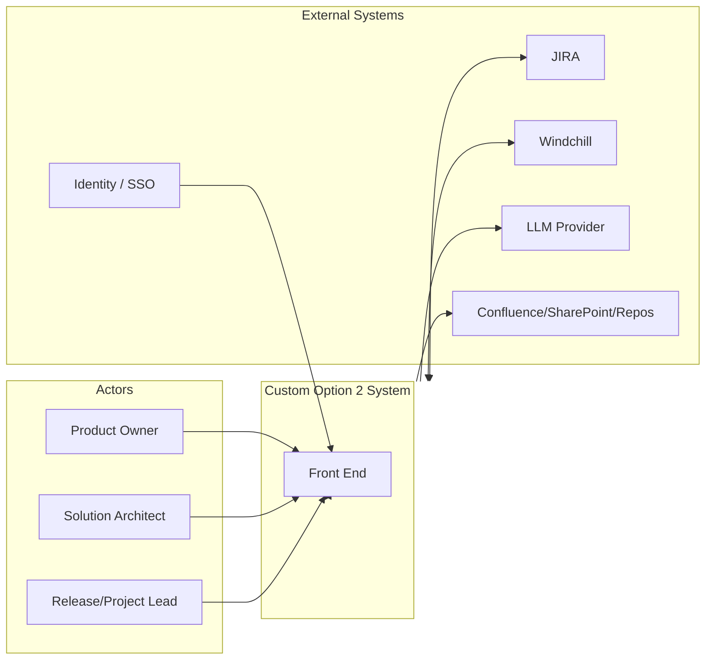
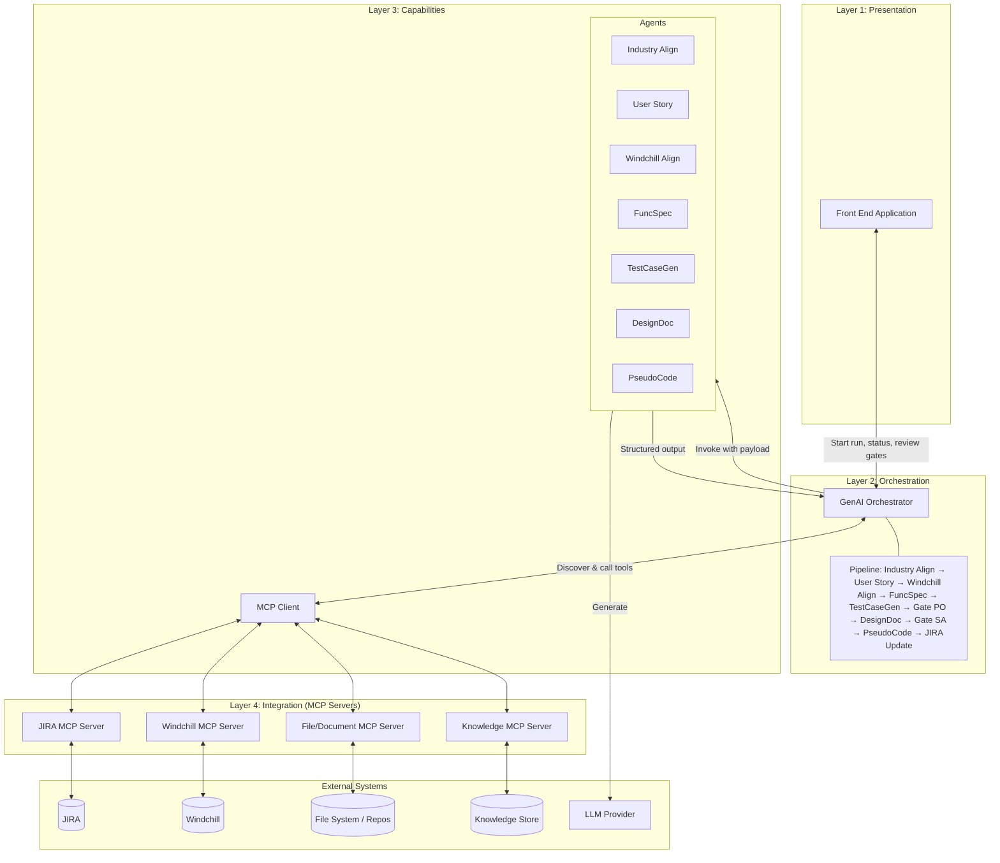
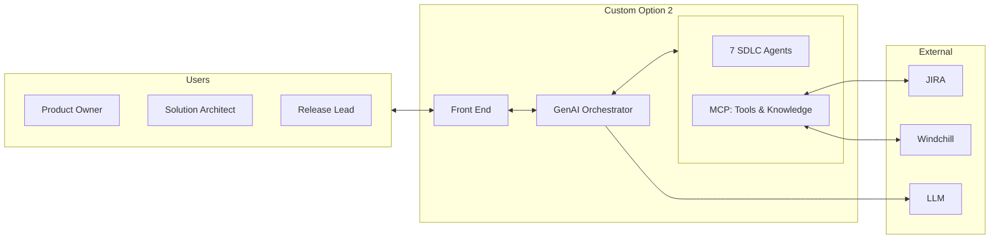
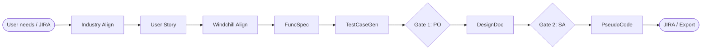
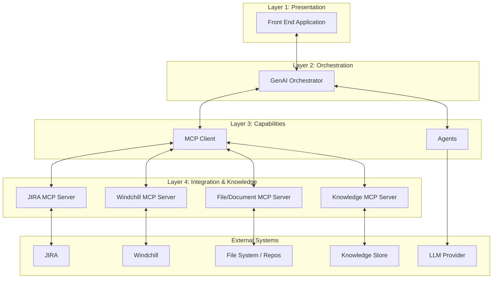
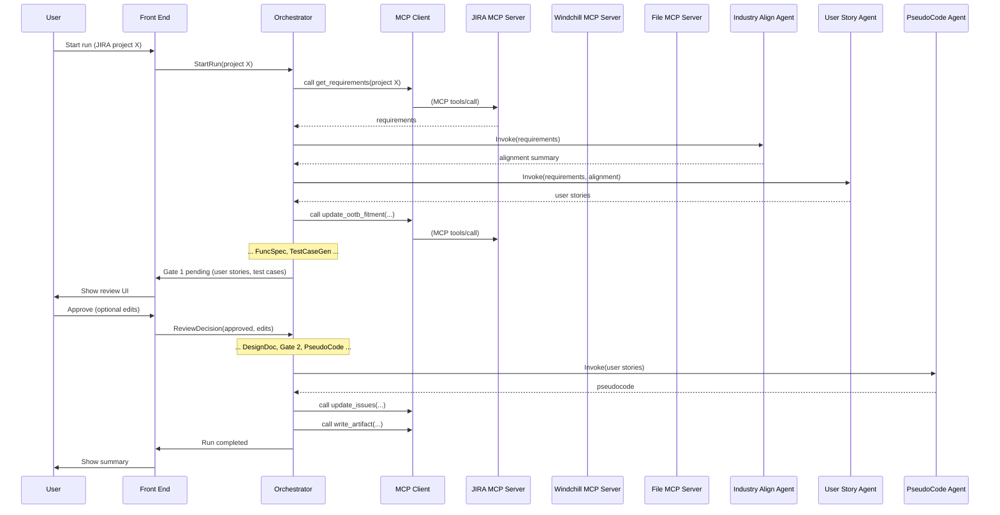
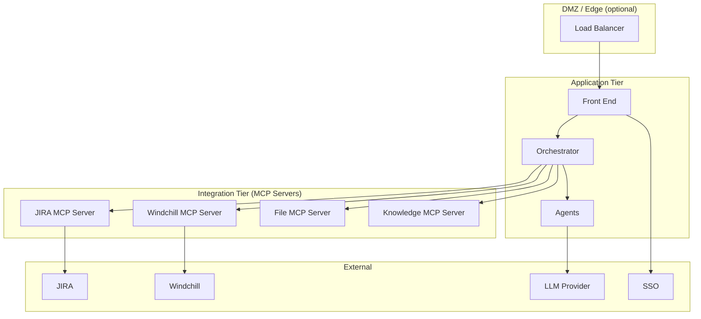

# Architectural Design: Custom Option 2 (Type C GenAI for NextGen PLM)

**Document type:** Architectural Design  
**Context:** GE HealthCare NextGen PLM – AI in SDLC  
**Solution:** Custom Option 2 – GenAI Orchestrator + Tools, Agents, Knowledge  
**Date:** February 2026  
**Status:** Strictly Private and Confidential – PROVISIONAL. No code changes implied.

---

## 1. Purpose and Scope

This document describes the **architectural design** for Custom Option 2: a custom-built GenAI solution that orchestrates SDLC agents (Industry Align → User Story → Windchill Align → FuncSpec → TestCaseGen → DesignDoc → PseudoCode) with human-in-the-loop gates, integrated with JIRA and Windchill. It is intended for solution architects, technical leads, and implementers. It defines structure, components, interfaces, data flows, and key design decisions; it does not specify implementation code.

**In scope:** Logical and deployment views of the system; component responsibilities and interfaces; integration via MCP and external systems; security and governance posture.  
**Out of scope:** Detailed API specs, database schemas, or line-by-line implementation.

---

## 2. System Context

### 2.1 Actors

| Actor | Role | Interaction with system |
|-------|------|--------------------------|
| **Product Owner** | Approves user stories and test cases | Uses front end to review outputs of User Story and TestCaseGen agents; approves or rejects; optionally edits. |
| **Solution Architect** | Approves functional spec and design document | Uses front end to review FuncSpec and DesignDoc outputs; approves or rejects; optionally edits. |
| **Release / Project lead** | Triggers pipeline runs | Uses front end to start a run (e.g. from list of user needs or JIRA epic/project). |
| **System** | Automated trigger | Optional: scheduler or event (e.g. JIRA project created) triggers a run. |

### 2.2 External Systems

| System | Role | Direction |
|--------|------|-----------|
| **JIRA** | Source of requirements/user needs; store for user stories, test case links, OOTB fitment fields; status and references. | Bidirectional (read/write). |
| **Windchill** | PLM/solution metadata; OOTB capability and fitment information. | Primarily read (or manual/semi-manual input if API limited). |
| **LLM provider(s)** | Azure OpenAI, OpenAI, or other – used by Agents for generation. | Outbound from Agents. |
| **Document stores / Repos** | Confluence, SharePoint, Git – for publishing finalized artifacts. | Outbound (write/export). |
| **Identity / SSO** | Enterprise identity provider for front end and API access. | Inbound (authenticate/authorize). |

### 2.3 Context Diagram

---

## 3. Architectural Diagram

This section provides the **main architectural diagram** of Custom Option 2 and a **simplified view** for high-level communication.

### 3.1 Main Architectural Diagram (Full System)

The diagram below shows all four layers, the GenAI Orchestrator at the center, the seven SDLC agents, the MCP client and MCP servers, and connections to external systems. Data and control flow **down** from the Front End through the Orchestrator; the Orchestrator invokes **Agents** (for generation) and the **MCP Client** (for tools); MCP servers talk to **external systems**. Agents call the **LLM**; they do not call JIRA, Windchill, or file systems directly.

**Legend:**

- **Front End** – User interface for triggering runs, viewing outputs, and Product Owner / Solution Architect reviews.
- **GenAI Orchestrator** – Runs the pipeline, routes data, calls Agents and MCP tools, enforces human gates and audit.
- **Agents** – Seven specialist agents; they receive input from and return output to the Orchestrator; they call the LLM only.
- **MCP Client** – Used by the Orchestrator to discover and invoke tools on MCP servers.
- **MCP Servers** – Expose JIRA, Windchill, file/document, and knowledge operations as MCP tools/resources.
- **External Systems** – JIRA, Windchill, file system/repos, knowledge store, and LLM provider.

### 3.2 Simplified Architectural Diagram (Executive / Overview)

A reduced view for presentations or one-page overviews: three blocks (Front End, Orchestrator + Agents + Tools, External) and the main flow.

### 3.3 Pipeline Flow (Agent Sequence)

Order of execution along the pipeline (data flows left to right; human gates between TestCaseGen and DesignDoc, and between DesignDoc and PseudoCode).

---

## 4. Architectural Goals and Constraints

### 4.1 Goals

- **Vendor independence:** Ability to swap LLM providers and add/replace agents or tools without rewriting the core pipeline.
- **Clear separation of concerns:** Orchestration, agent logic, tool integration, and knowledge are separate; agents do not call external systems directly.
- **Human-in-the-loop:** Two explicit approval gates (Product Owner, Solution Architect) with audit trail.
- **Extensibility:** New agents, tools, or knowledge sources can be added via configuration or new MCP servers.
- **Observability:** Runs are traceable; token usage and failures can be monitored for cost and reliability.

### 4.2 Constraints

- **No direct agent–system calls:** Agents receive and return data only via the Orchestrator; all JIRA/Windchill/file access goes through the Tools layer (MCP).
- **Enterprise security:** Identity via enterprise SSO; secrets in secure store; data in transit and at rest encrypted; processing in approved regions.
- **Compliance:** Audit log of runs, approvals, and tool invocations; alignment with GE HealthCare data and AI policies.

---

## 5. Logical Architecture

### 5.1 Layered View

The system is organized in four logical layers plus external systems.

### 5.2 Component Summary

| Layer | Component | Responsibility |
|-------|-----------|----------------|
| **Presentation** | Front End | Trigger runs, display status and agent outputs, host human-in-the-loop review UI, enforce role-based access. |
| **Orchestration** | GenAI Orchestrator | Execute pipeline definition, route data between steps, call Agents and MCP tools, manage human gates and audit. |
| **Capabilities** | Agents | Seven specialist agents (Industry Align, User Story, Windchill Align, FuncSpec, TestCaseGen, DesignDoc, PseudoCode); consume inputs from Orchestrator, call LLM, return structured output. |
| **Capabilities** | MCP Client | Discover and invoke tools exposed by MCP servers; used by Orchestrator (and optionally by Agents if design allows). |
| **Integration** | JIRA MCP Server | Expose JIRA operations as MCP tools (get issues, update fields, create/update issues). |
| **Integration** | Windchill MCP Server | Expose Windchill fitment/metadata operations as MCP tools (or thin wrapper for manual input). |
| **Integration** | File/Document MCP Server | Expose read/write artifacts, templates, export as MCP tools. |
| **Integration** | Knowledge MCP Server | Expose standards, templates, playbooks (or RAG) as MCP resources/tools. |

---

## 6. Component Design

### 6.1 Front End Application

**Responsibility:** Single entry point for users to trigger pipeline runs, view run status and agent outputs, and perform Product Owner and Solution Architect reviews.

**Interfaces (conceptual):**

- **To Orchestrator:** Start run (input: source type “user needs list” or “JIRA project/epic”, identifier); get run status (run ID); get step output (run ID, step name); submit review decision (run ID, gate ID, approved/rejected, optional edits); get run history (filtered by user/role).
- **From Orchestrator:** Run created (run ID); step completed (run ID, step name, output summary or reference); gate pending (run ID, gate ID, context for review); run completed / failed.

**Design notes:**

- Authenticate via enterprise SSO; authorize by role (e.g. Release Lead can start runs; Product Owner can approve gate 1; Solution Architect can approve gate 2).
- For human gates, front end displays the artifacts to review (e.g. user stories + test cases, or functional spec + design doc) and sends approve/reject/edits back so Orchestrator can resume or abort.

### 6.2 GenAI Orchestrator

**Responsibility:** Execute the SDLC pipeline; pass data between agents and tools; enforce human-in-the-loop gates; persist run state and audit events.

**Pipeline definition (logical):**

1. Load input (via MCP: JIRA or user-provided list).
2. Industry Align Agent → store output, pass forward.
3. User Story Agent → store output, pass forward.
4. Windchill Align Agent → store output; call JIRA MCP to update OOTB fitment fields.
5. FuncSpec Agent → store output.
6. TestCaseGen Agent → store output; optionally call JIRA MCP to attach test cases.
7. **Gate 1:** Notify front end (Product Owner review); wait for decision; on reject/abort, end run; on approve (with optional edits), apply edits and continue.
8. DesignDoc Agent → store output.
9. **Gate 2:** Notify front end (Solution Architect review); wait for decision; on reject/abort, end run; on approve, continue.
10. PseudoCode Agent → store output.
11. Call JIRA MCP to update issues (status, links, references).
12. Optionally call File MCP to export artifacts to Confluence/SharePoint/repos.

**Interfaces (conceptual):**

- **To Front End:** As above (start run, status, step output, review decision, history).
- **To Agents:** Invoke agent (agent ID, input payload); receive structured output (or error). Contract: input/output payloads are standardized per agent type (e.g. user stories payload has agreed schema).
- **To MCP Client:** List tools (optional); call tool (tool name, parameters); receive result. Orchestrator never calls JIRA/Windchill/files directly—only via MCP.

**State and audit:**

- Each run has a unique run ID; step outputs are stored (in-memory or persistent store) for the duration of the run and for audit.
- Events: run started, step started/completed/failed, gate pending/completed, run completed/failed. Logged with timestamp, run ID, step/gate ID, and optionally user ID for gates.

### 6.3 Agents

**Responsibility:** Implement one specialist role each; receive input payload from Orchestrator; call LLM (and optionally Knowledge via Orchestrator or MCP); return structured output. Agents do **not** call JIRA, Windchill, or file systems directly.

**Common contract:**

- **Input:** Opaque or typed payload (e.g. requirements list, user stories list, functional spec document) provided by Orchestrator.
- **Output:** Structured result (e.g. alignment table, user stories JSON, Markdown document) plus optional metadata (confidence, warnings).
- **Failure:** Return error code and message; Orchestrator decides retry or fail run.

**Per-agent role (summary):**

| Agent | Input | Output |
|-------|--------|--------|
| Industry Align | Requirements | Requirement, Meets Industry Practice, Rationale, Alignment Actions |
| User Story | Requirements + alignment | Epics, user stories (Actor, Description, Prerequisites, Steps, Business rules, Expected output, Migration/Integration needs) |
| Windchill Align | User stories | Fitment assessment (per story or aggregate); Orchestrator uses JIRA MCP to write OOTB fitment fields |
| FuncSpec | User stories + fitment | Functional specification document (agreed format) |
| TestCaseGen | User stories / functional spec | Test cases (agreed file format) |
| DesignDoc | Functional spec + context | System overview, HLD, LLD, design decisions (e.g. Markdown) |
| PseudoCode | User stories (customization scope) | Structured pseudocode by epic/feature |

**LLM and Knowledge:** Each agent uses one or more LLM calls (prompts, model, temperature as configured). Optionally, Orchestrator passes retrieved Knowledge (e.g. from Knowledge MCP) as part of the input payload so the agent can ground its output in standards and templates.

### 6.4 MCP Client (within Orchestrator boundary)

**Responsibility:** Connect to one or more MCP servers; discover tools (`tools/list`); invoke tools (`tools/call` with name and parameters); return results to Orchestrator. Credentials and connection details (per MCP server) are configured securely; MCP Client does not contain business logic—only protocol handling.

### 6.5 MCP Servers (Tools and Knowledge)

**JIRA MCP Server**

- **Exposed tools (conceptual):** `get_issues`, `get_requirements`, `create_or_update_issue`, `update_custom_fields` (e.g. OOTB fitment). Each tool has a name, description, and JSON Schema for parameters.
- **Backing:** JIRA REST API (or equivalent); credentials in secure store; least-privilege JIRA user/app.

**Windchill MCP Server**

- **Exposed tools (conceptual):** `get_solution_metadata`, `get_ootb_capabilities`, `evaluate_fitment` (or a single `submit_fitment_input` if process is manual/semi-manual).
- **Backing:** Windchill API if available; otherwise thin server that accepts manual input and exposes a consistent interface so Orchestrator flow is unchanged.

**File/Document MCP Server**

- **Exposed tools (conceptual):** `read_file`, `write_artifact`, `list_templates`, `export_to_path` (or `export_to_confluence`, `export_to_sharepoint`).
- **Backing:** File system or document store; credentials as needed for Confluence/SharePoint.

**Knowledge MCP Server**

- **Exposed tools/resources (conceptual):** `search_standards`, `get_template`, `get_playbook`; or MCP resources for document retrieval (e.g. for RAG).
- **Backing:** Curated store (files, DB, or vector store for RAG); access control and versioning.

---

## 7. Data Flow: End-to-End Run

### 7.1 Sequence (Simplified)

### 7.2 Payload Flow Between Steps

Data flows unidirectionally along the pipeline; each step consumes the outputs it needs (orchestrator passes them):

- **Requirements** (from JIRA or list) → Industry Align, User Story (with alignment).
- **User stories** → Windchill Align, FuncSpec, TestCaseGen (with spec), PseudoCode (for customization scope).
- **Fitment** → JIRA (OOTB fields); also available to FuncSpec/DesignDoc if needed.
- **Functional spec** → DesignDoc.
- **Gate 1** uses: user stories, test cases.
- **Gate 2** uses: functional spec, design document.
- **Final update** uses: all relevant outputs to update JIRA and optionally export artifacts.

---

## 8. Deployment Architecture

### 8.1 Logical Deployment Nodes

### 8.2 Deployment Options (Conceptual)

| Option | Description |
|--------|-------------|
| **Single region** | Front End, Orchestrator, Agents, and MCP servers in one approved cloud region (e.g. Azure or AWS); all in same VPC with private connectivity to JIRA/Windchill/LLM where possible. |
| **Tiered** | Front End in DMZ or public subnet (with WAF); Orchestrator and Agents in private app tier; MCP servers in integration tier with outbound-only access to JIRA, Windchill, and LLM. |
| **Hybrid** | Front End and Orchestrator in cloud; MCP servers or Agents on-premises if GE HealthCare requires certain integrations to run inside the firewall. |

Secrets (JIRA, Windchill, LLM API keys) are stored in a secure vault (e.g. cloud provider secrets manager or HashiCorp Vault); applications pull at runtime. No secrets in code or config files.

---

## 9. Security and Governance

### 9.1 Authentication and Authorization

- **Front End:** Users authenticate via enterprise SSO (e.g. SAML/OIDC). Session or token is validated on each request.
- **Orchestrator API:** If exposed (e.g. for front end or automation), validate token or API key; authorize by role (who can start run, who can submit review).
- **MCP servers:** Orchestrator (or MCP Client) connects to MCP servers over secure transport (TLS); MCP server may use its own auth (e.g. API key, mTLS) if required. Per-server credentials in vault.
- **Agents:** Invoked by Orchestrator only (internal); agents call LLM with API key from vault.

### 9.2 Data Protection

- **In transit:** TLS for all client–server and server–external system communication.
- **At rest:** Encryption for any persisted run state, logs, or caches (e.g. disk encryption, encrypted DB).
- **Sensitive data:** Requirements and generated artifacts may contain confidential information; access to run outputs is restricted by role; audit log records who accessed what.

### 9.3 Audit and Compliance

- **Orchestrator** logs: run ID, user/trigger, start/end time, each step (started/completed/failed), each gate (pending, decided by whom, approved/rejected), and tool invocations (tool name, run ID; payload may be redacted or hashed for privacy).
- **Retention:** Per GE HealthCare policy; logs and run history available for compliance and troubleshooting.
- **Responsible AI:** Human gates ensure no automatic publish of high-impact artifacts; prompt and model guardrails as per policy; optional review of agent outputs before they are written to JIRA.

### 9.4 Vendor Neutrality (LLM)

- **Abstraction:** Agent component calls an internal “LLM gateway” or adapter that accepts model name and prompt; the adapter translates to the chosen provider (Azure OpenAI, OpenAI, etc.).
- **Configuration:** Provider and model are configurable (e.g. by environment or tenant); no hard-coded vendor in agent logic.

---

## 10. Key Design Decisions

| Decision | Rationale |
|----------|------------|
| **Tools exposed via MCP** | Standard protocol for tool discovery and invocation; easy to add new integrations (new MCP server); aligns with ecosystem (Copilot Studio). |
| **Agents do not call external systems** | Clear separation; agents are swappable and testable with mock data; all integration and security live in MCP servers and Orchestrator. |
| **Orchestrator owns pipeline and gates** | Single place for sequence, retries, and human gates; front end only displays and submits decisions; no business logic in UI. |
| **Two human gates (PO, SA)** | Matches GE HealthCare SDLC and ensures accountability before user stories/test cases and before design/pseudocode are committed. |
| **Structured payloads per step** | Enables versioning of agent contracts and backward compatibility when adding or changing agents. |
| **LLM abstraction** | Enables swap of provider without changing agent implementations. |

---

## 11. Document References

- **Outline:** [03-Custom-Option-2-Outline.md](03-Custom-Option-2-Outline.md) – purpose, rationale, pipeline, phasing, MCP, risks, next steps.
- **Overview:** [01-NextGen-PLM-AI-in-SDLC-Overview.md](01-NextGen-PLM-AI-in-SDLC-Overview.md) – SDLC flow, agent details, options.

---

**Document control**  
Strictly Private and Confidential – PROVISIONAL, for planning purposes only. This architectural design does not authorize or specify implementation code; it is for design and decision-making only.
